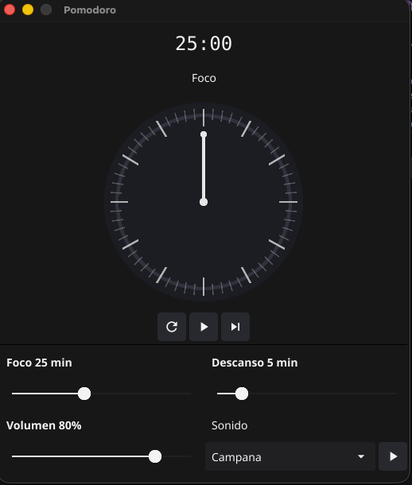

# Time's Up — Pomodoro Timer

Aplicación de escritorio Pomodoro construida en Go con interfaz gráfica nativa via [Fyne](https://fyne.io/). Todos los sonidos se generan matemáticamente, sin archivos de audio externos.


---

## Características

- Temporizador circular con aguja y arco de progreso animado
- Fases **Foco** (verde) y **Descanso** (azul) con transición automática
- Sonido al finalizar cada fase — generado por síntesis de ondas (sin archivos)
- 4 tipos de sonido: Campana, Pitido, Campanilla, Doble campana
- Botón de vista previa para escuchar el sonido antes de usarlo
- Controles de duración de foco (1–60 min), descanso (1–30 min) y volumen
- Botones Play/Pausa, Reiniciar y Saltar fase

---

## Capturas

<table>
<tr>
<td></td>
<td valign="top" style="padding-left: 24px;">

**① Tiempo restante** — contador grande en formato MM:SS

**② Fase actual** — *Foco* (verde) o *Descanso* (azul)

**③ Dial circular** — aguja y arco de progreso animados con tick marks por minuto

**④ Controles** — Reiniciar `↺`, Play/Pausa `▶⏸`, Saltar `⏭`

**⑤ Sliders** — duración de Foco y Descanso configurables en tiempo real

**⑥ Sonido** — selector con botón de vista previa `▶`

</td>
</tr>
</table>

---

## Requisitos

- Go 1.21 o superior
- Dependencias del sistema para Fyne (OpenGL + C compiler):

**macOS**
```bash
xcode-select --install
```

**Linux (Debian/Ubuntu)**
```bash
sudo apt-get install gcc libgl1-mesa-dev xorg-dev
```

**Windows**
```
MinGW-w64 (gcc disponible en PATH)
```

---

## Instalación y ejecución

```bash
git clone https://github.com/tu-usuario/times-up.git
cd times-up

go mod download
go run ./cmd/timesup
```

Para compilar un binario:

```bash
go build -o times-up ./cmd/timesup
./times-up
```

> **Nota macOS:** El linker puede emitir `ld: warning: ignoring duplicate libraries: '-lobjc'`. Es un bug conocido del toolchain (fyne-io/fyne#4314) y no afecta el funcionamiento.

---

## Estructura del proyecto

```
times-up/
├── cmd/
│   └── timesup/
│       └── main.go          # Entry point: ventana Fyne, layout y conexión de componentes
├── internal/
│   ├── audio/
│   │   └── audio.go         # Síntesis de sonido PCM via oto
│   ├── timer/
│   │   └── timer.go         # Lógica del temporizador (goroutine + mutex)
│   └── ui/
│       └── dial.go          # Widget circular personalizado (Fyne WidgetRenderer)
├── go.mod
├── go.sum
├── LICENSE
└── README.md
```

Los paquetes bajo `internal/` son privados al módulo y no pueden ser importados desde fuera del proyecto.

---

## Sonidos disponibles

Todos los sonidos se generan como PCM a 44100 Hz estéreo 16-bit. No hay archivos de audio.

| Nombre | Tipo de onda | Descripción |
|---|---|---|
| **Campana** | Seno puro | Tono suave a 440 Hz con decay exponencial |
| **Pitido** | Onda cuadrada | Beep corto a 880 Hz, timbre más duro |
| **Campanilla** | 3 senos en secuencia | Acorde descendente C5 → G4 → E4 |
| **Doble campana** | Seno + armónico 2f | 440 Hz + 880 Hz mezclados (más brillante) |

### Fórmulas de síntesis

```
Campana:        sin(2π·440·t) · e^(-3t/d)
Pitido:         square(880·t) · e^(-5t/d)
Campanilla:     sin(2π·f·t) · e^(-3t/d)   para f ∈ {523.25, 392, 329.63}
Doble campana:  [sin(2π·440·t) + 0.5·sin(2π·880·t)] / 1.5 · e^(-2.5t/d)
```

---

## Dependencias principales

| Paquete | Versión | Uso |
|---|---|---|
| `fyne.io/fyne/v2` | v2.5.3 | GUI nativa (ventana, widgets, canvas) |
| `github.com/ebitengine/oto/v3` | v3.3.3 | Salida de audio PCM de bajo nivel |

---

## Licencia

Este proyecto se distribuye bajo la licencia MIT. Consulta [LICENSE](LICENSE) para el texto completo.
